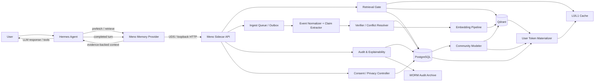
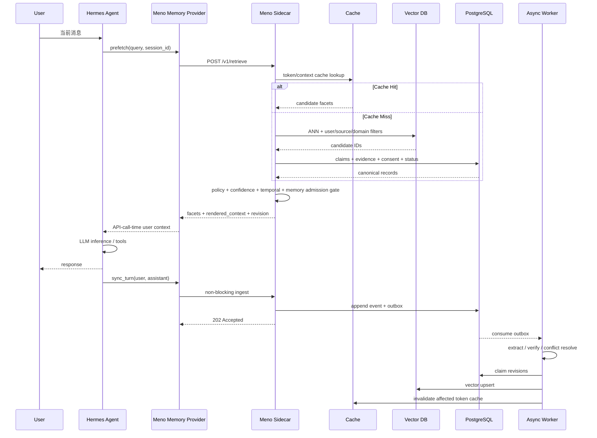
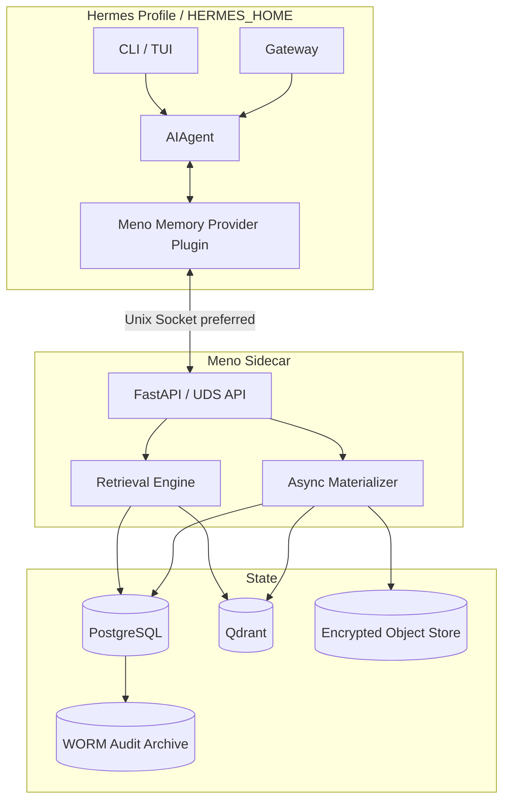
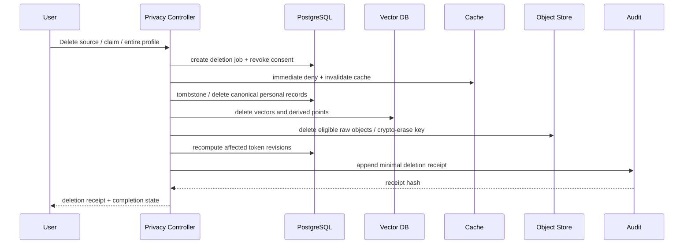

# Meno User Token v1.0 架构设计：Human as a Token in the Social Context

## Executive Summary

本文给出一个面向生产试验的 **Meno User Modeling Sidecar v1.0** 架构。其核心思想不是把“人”压缩成一个不可解释的 embedding，更不是把用户画像 fine-tune 进模型参数，而是把用户建模成一个**可版本化、可检索、可纠正、可撤销、带证据链的逻辑 User Token**：

> **Human as a token in the social context = 在每次 Agent 推理时，将“此人此刻在此情境下的社会语义先验 + 个人历史残差 + 动态状态 + 证据与不确定性”组装为一个可被模型消费的上下文对象。**

这与三份输入文档形成一致方向。`spec-discussion` 已将 Meno 定义为“语义群为先验、个人历史为残差”的独立用户建模层，并明确 `ingest / retrieve / predict / feedback / audit` 五个动词、读写分离和“外部状态 + 运行时组装”的工程路线。 `KDA/AttnRes` 参考文档进一步给出三个值得继承的动力学思想：**压缩即残差、细粒度遗忘、更新应替换旧 belief 而非无限追加**；同时明确指出 KDA 内部数值状态不可审计，因此 Meno 必须在表示形态上与之分道。 用户建模调研则显示，当前系统真正困难的部分已经从“能否保存事实”转移到“能否跨源抽象、处理时间漂移、避免过度推断、主动获取缺失偏好”。

研究文献强化了这个判断。Setoka 将用户理解拆成语义记忆、情节记忆、行为模式、人格特质四级，并发现越向高层抽象，现有 memory system 的能力越明显下降。 DynamicMem 在长达 15 个月、平均约 220 万 token、16 类应用的轨迹中发现，超过 93% 的失败来自 memory retrieval 而非回答模型，并特别暴露了“稳定事实保留”和“动态事实替换”难以兼得的问题。 更重要的是，Personalization Mirage 对 12 个模型和 143,616 条判断的实验中观察到约 35%–49% 的用户属性过度推断，均值 41.6%，说明“模型自己觉得自己理解用户”不能作为可信度依据。 Re-Centering Humans 的真人数据实验也发现，合成数据会高估个性化能力，真人对话中的 attribute extraction、relevance matching 和最终个性化效果均存在明显落差。

因此，**v1.0 的最重要工程决策是：User Token 不是一个向量，而是一个有向量视图的、可审计的状态对象。**

建议 v1.0 采用以下生产试验基线：

| 决策项 | v1.0 推荐 |
|---|---|
| Hermes 基线 | Hermes Agent `v0.20.4`，2026-08-18 发布  |
| Hermes 集成点 | **Memory Provider Plugin 优先**；MCP/HTTP 作为跨 Agent 的第二接口 |
| 运行模式 | Hermes 进程 + 本机/同 Pod Meno Sidecar；Hermes 不直接访问 DB |
| Canonical Store | PostgreSQL：event、claim、preference、community membership、consent、revision |
| Vector Index | **Qdrant**，只作为可重建派生索引；Postgres 才是真值源 |
| Embedding | **Google `gemini-embedding-001` cloud API，768 维**；document/query task type 分离；禁止加载本地 embedding runtime |
| Audit | PostgreSQL append-only audit + hash chain；周期性封存到 WORM/Object Lock |
| Cache | Hermes provider 内进程 L0 + Sidecar L1；多副本后再引入 Redis |
| 更新语义 | append event → derive claim → **supersede old claim** → rebuild materialized token |
| 社群模型 | soft membership，不允许默认推断受保护人口属性 |
| Prompt 方式 | 检索出的 evidence-backed facets 注入当前 turn；**不把整个 User Token 塞进 system prompt** |
| 安全退化 | Sidecar 故障时 **fail-open personalization / fail-closed privacy**：Hermes 仍能回答，只失去个性化 |
| v1 非目标 | LoRA 用户画像、原始聊天全量 prompt 注入、自动高风险 proactive action、不可追踪人格推断 |

这一方案直接利用 Hermes 已有的扩展面。当前 Hermes 架构中已经存在 `agent/memory_manager.py`、`agent/memory_provider.py` 和 `plugins/memory/`；Memory Provider 支持 `prefetch()`、`queue_prefetch()`、`sync_turn()`、`on_pre_compress()`、`on_memory_write()` 等 lifecycle hook，并明确规定 `sync_turn()` 必须是 non-blocking。  这意味着 Meno v1.0 **无需 fork Hermes Agent loop，也无需修改 prompt builder**，即可完成读、写、预取、压缩前同步和显式 memory write 镜像。

## 设计目标与核心抽象

**设计目标。** Meno v1.0 的成功标准不是“系统声称更懂用户”，而是：对于 Agent 当前任务，它能以足够低的延迟找出少量真正相关、证据充分、时间上仍有效的用户信息；对于每一个被使用的个性化结论，都可以回答“从哪里来、何时产生、为什么相信、是否已过期、用户是否确认、怎样删除”。

这尤其重要，因为长期记忆并非单纯的 utility layer。近期针对 personal agent memory 的研究指出，长期记忆本身会成为一个持续控制通道，错误或恶意 memory retrieval 可能造成跨域泄漏、tool-call drift、sycophancy 甚至 memory-induced jailbreak，因此“相似”不能等价于“允许注入”。

**核心设计原则如下。**

| 原则 | v1.0 工程含义 | 明确反模式 |
|---|---|---|
| 可审计性 | 所有 claim、preference、community membership 均有 evidence refs、extractor version、revision、时间信息 | “模型认为用户是 X”但无法回查来源 |
| 可写入 / 可调取 | 写路径事件化；读路径 context-conditioned；读写不共享同步临界路径 | 每轮把全部 history 重新总结 |
| 可纠正 | 新证据与旧结论冲突时 `supersede`，不是并列堆积；用户反馈优先级最高 | “用户现在喜欢 B”旁边永久保留“喜欢 A”且都 active |
| 可扩展 | raw event、semantic claim、distribution、vector index 分层；embedding 与 schema 独立版本 | embedding model 一换全系统 schema 作废 |
| 隐私默认 | purpose/scopes/source 全部显式；敏感字段默认不推断；删除能够传播到派生状态 | 为“未来可能有用”无限采集 |
| 低延迟 | document embedding/extraction 异步批处理；query embedding 设超时、缓存和 canonical fallback | `retrieve()` 内加载本地模型或临时跑长 LLM summarization |
| 不确定性是一等公民 | “未知”优于猜测；confidence 来自证据/calibration，而非 LLM self-confidence | 把模型自报概率当事实可信度 |
| Context-specific | 不存在“全局唯一人格 prompt”；每次只激活当前 task 需要的 facets | 一次生成 USER.md 后永久注入全部内容 |
| 社会先验非刻板标签 | community 是语义参与关系，而非人口统计 stereotype | 自动把年龄、族裔、政治倾向等当 community prior |
| 派生状态可重建 | 向量、cluster、token snapshot 都可从 canonical event/claim replay | vector DB 成为唯一事实源 |

**“User Token”应被理解为逻辑 token，而不是 tokenizer vocabulary token。** 普通 Hermes LLM 无法直接对一段任意 float vector 做 attention；因此 v1.0 中高维表示用于 Sidecar 内部检索、聚类、相似度和残差计算，真正交给 Hermes 的是经过 evidence gate 后生成的结构化 `<user_context>` 或 tool result。参数化 soft prompt / learned user token 可以作为后续实验，但不应承担可审计事实。这个边界与输入文档“排除参数化 user model、运行时组装外部状态”的决策一致。

可以把逻辑 User Token 表达为：

\[
U(c,t)=
\left[
S_{\text{long}}(t),
G_{\text{social}}(c,t),
R_{\text{personal}}(c,t),
B_{\text{seq}}(t),
P_{\text{pref}}(c,t),
C(t),
\Pi
\right]
\]

其中：

\[
G_{\text{social}}(c,t)=\sum_{g \in G}w_g(c,t)\mu_g
\]

\[
R_{\text{personal}}(c,t)=z_{\text{user}}(c,t)-G_{\text{social}}(c,t)
\]

`μ_g` 是 semantic community centroid，`w_g` 是当前情境下该 community 对用户的 soft membership，`R_personal` 则表示用户相对于社区先验的个人偏移。这把输入文档提出的“人类共性 / 社群条件 / 个人残差”三层结构落实为可实现的数据模型：人类共性留给 foundation model，不重复存储；Meno 负责 community prior 与 personal residual。

这种设计还可以吸收 KDA 的思想，但需要做一次重要转译。Kimi Linear 中的 KDA 使用更细粒度 gating 来管理有限状态中的遗忘，其目标是提高内部序列记忆效率。 **Meno 不应直接给 raw embedding 的第 137 维设置“用户偏好半衰期”**，因为 embedding coordinate 没有稳定、可审计的业务语义，换模型后含义还会改变。正确做法是把 KDA 的“逐通道遗忘”提升为**逐语义 channel 遗忘**：

| Semantic channel | 典型 half-life 策略 |
|---|---|
| 用户明确身份事实 | 无自动衰减或极慢，除非出现冲突 |
| 工作环境 / 项目状态 | 周到月 |
| 长期行为模式 | 月级，并要求跨窗口重复证据 |
| 稳定偏好 | 月到季度，但显式反馈可立即覆盖 |
| 当前目标 | 小时到天 |
| 情绪 / 临时状态 | 分钟到小时 |
| community membership | 周到月，通过周期性聚类重估 |
| 推断人格特质 | 默认低 confidence，慢更新但必须多源支持 |

因此 v1.0 的“忘”是**看得见的忘**：claim 本身不从审计历史消失，而是其 `effective_confidence` 衰减、`status` 变化，最终不再进入 retrieval。

时间衰减建议采用简单且可解释的半衰期：

\[
c_{\text{effective}}(t)=
c_{\text{calibrated}}
\cdot
e^{-\ln(2)\Delta t/h}
\]

其中 `h` 是 semantic channel 的 half-life。显式用户确认可以刷新时间戳或提升 calibrated confidence；显式否定则直接触发 `superseded/rejected`，不等待自然衰减。

## User Token 数据模型与演进

**Canonical representation 应由“显式语义层 + 高维派生层”共同组成。** Setoka 的结果支持至少区分 semantic、episodic、behavior pattern 和 trait 等不同抽象层次，而不是把所有 memory 当成同一种 chunk。 Memori 等工作也表明，将 raw conversation 转为紧凑结构化表示可以显著减少 retrieval 时需要重新注入的上下文量。

建议数据模型如下：

| 维度 | 数据类型 | Canonical store | Vector view | 更新方式 |
|---|---|---|---|---|
| 长期历史状态 | `Claim[]`：fact / episodic / pattern / trait / constraint | PostgreSQL | `semantic_embedding` | event-derived + supersede |
| 社会语义群 | `CommunityMembership[]`，soft probability | PostgreSQL | `social_prior_vector` | 周/月级 batch |
| 行为序列 | `EventRef[]` + rolling window state | PostgreSQL / object store | `behavior_recent_vector` | 高频 append |
| 个人残差 | 派生对象 | revision snapshot | `personal_residual_vector` | token materialization |
| 偏好分布 | Beta / Dirichlet / Normal / empirical pairwise | PostgreSQL | 可选 preference vector | feedback + evidence |
| 当前状态 | typed ephemeral claim | PostgreSQL TTL semantic state | recent-state vector | 高频、快 decay |
| 置信度 | float + components | PostgreSQL | payload filter | verifier/calibration |
| 时间衰减 | half-life + timestamps | PostgreSQL | payload effective score | query-time/materialize |
| 来源 | `EvidenceRef[]` | PostgreSQL | payload IDs | immutable |
| 审计元数据 | extractor/model/prompt/schema/trace IDs | append-only audit | 不进入 embedding | immutable |
| 用户授权 | source/purpose/scope/expiry | consent table | retrieval filter | user/admin action |

**Claim 不等于一段总结文本。** 一个生产级 claim 至少需要：

```json
{
  "claim_id": "019c8d77-9ab1-7d01-8fd0-12f635c112b1",
  "user_id": "usr_anoki",
  "claim_type": "preference",
  "semantic_channel": "response_style.detail_level",
  "value": {
    "type": "categorical",
    "label": "concise_by_default"
  },
  "scope": {
    "domain": "software_engineering",
    "platform": "*"
  },
  "confidence": {
    "calibrated": 0.91,
    "effective": 0.86,
    "support_count": 7,
    "contradiction_count": 1,
    "user_confirmed": true,
    "half_life_days": 180
  },
  "validity": {
    "observed_from": "2026-06-11T18:20:00Z",
    "valid_from": "2026-06-11T18:20:00Z",
    "valid_to": null,
    "status": "active",
    "supersedes": [
      "019a661b-c7d0-7833-b277-04725b1d32fb"
    ]
  },
  "evidence": [
    {
      "event_id": "evt_019c8c...",
      "source_type": "hermes_turn",
      "source_locator": "hermes://profile/default/session/s_42/turn/8",
      "content_hash": "sha256:...",
      "relation": "explicit_confirmation"
    }
  ],
  "provenance": {
    "schema_version": "1.0.0",
    "extractor": "meno-claim-extractor",
    "extractor_version": "2026-08-18.1",
    "embedding_model": "gemini-embedding-001",
    "embedding_revision": "gemini-embedding-001-768-v1",
    "prompt_hash": "sha256:...",
    "trace_id": "55ac..."
  }
}
```

**偏好必须建模成分布，而不是 Boolean profile。** 高维偏好往往只通过纠正逐步暴露，因此 v1.0 推荐提供三种基本 distribution：

| 场景 | 类型 | 示例 |
|---|---|---|
| 两态偏好 | `Beta(α, β)` | 是否希望 Agent 主动执行 |
| 多类别 | `Dirichlet(α₁…αₙ)` | terse / normal / detailed |
| 连续量 | `Normal(μ, σ²)` | 理想答案长度、主动性阈值 |
| 排序型 | empirical pairwise / logistic score | A 行动 vs B 行动 |

这样 `feedback` 的语义不再只是“写一句用户喜欢 X”，而是修改一个有不确定性的分布，同时保留产生该更新的 evidence。

**社会语义群必须是 soft membership。** 用户可以同时属于“LLM agent engineering”“摄影”“某研究社群”等多个语义世界，且不同任务下激活权重不同。不要将用户强制归到一个 cluster：

```json
{
  "community_memberships": [
    {
      "community_id": "comm_agent_memory_research",
      "label": "Agent Memory / Personalization Research",
      "weight": 0.78,
      "confidence": 0.84,
      "basis": ["reading_history", "notes", "conversation"],
      "last_updated_at": "2026-08-17T02:00:00Z"
    },
    {
      "community_id": "comm_film_photography",
      "label": "Film Photography",
      "weight": 0.31,
      "confidence": 0.68,
      "basis": ["notes"],
      "last_updated_at": "2026-08-01T02:00:00Z"
    }
  ]
}
```

其中 `label` 是可审计语义主题，而不是“25–34 岁科技男性”这类人口属性标签。对于健康、宗教、生物识别、金融、行踪等敏感信息，中国《个人信息保护法》施加更严格规则，并要求在特定高风险场景下采取单独同意等更强保护，因此 v1 的默认 policy 应明确禁止从普通行为中自动生成这类 community。

**Vector storage 采用多 named-vector，而不是把所有信息平均成一个 embedding。**

推荐：

```text
user_token_snapshot
├── semantic_state        // 稳定事实 / 模式 / trait 的语义表示
├── social_prior          // Σ w_g * community centroid
├── personal_residual     // user state - social prior
├── behavior_recent       // 最近行为窗口
└── preference_context    // 可选，偏好空间投影
```

Qdrant 原生支持一个 point 携带 vector 与 JSON payload，并支持 named/multiple vectors、payload index 和 metadata filtering，适合这一结构。 **但 Qdrant 中所有内容应视为 derived index。** Canonical truth 仍放在 PostgreSQL，vector collection 可以随时删掉并通过 event/revision replay 重建。

建议 PostgreSQL v1 schema 至少包含：

```text
meno_events
meno_claims
meno_claim_evidence
meno_preferences
meno_communities
meno_user_community_memberships
meno_token_revisions
meno_consents
meno_feedback
meno_audit_events
meno_outbox
meno_deletion_jobs
```

不要在 v1 引入 Neo4j 作为硬依赖。输入 spec 提出的“graph + temporal + vector”方向是合理的。 但对于第一版，community edge、claim relationship、supersedes edge 都可以先用 PostgreSQL adjacency table 表达；只有当多跳 social graph 查询成为真实性能瓶颈时再拆出图数据库，可显著降低初期运维面。

**Versioning 必须拆成四种版本，不能只放一个 `schema_version`：**

```json
{
  "schema_version": "1.0.0",
  "state_revision": 1842,
  "embedding_spec": {
    "provider": "google",
    "model": "gemini-embedding-001",
    "dimension": 768,
    "projection_version": "gemini-embedding-001-768-v1"
  },
  "extractor_version": "claim-extractor-2026.08.1",
  "policy_version": "meno-policy-1.0.0"
}
```

其中：

`schema_version` 管结构；`state_revision` 管用户状态时间序列；`projection_version` 管 embedding space；`extractor_version` 管从 event 到 claim 的生成逻辑；`policy_version` 管允许什么数据进入 retrieval。

Schema 演进规则建议固定为：

| 变化 | 版本规则 | 迁移 |
|---|---|---|
| 新增 optional field | minor | lazy migration |
| 修改字段含义 | major | compatibility adapter |
| embedding model/dimension 更换 | projection version | dual-index + background re-embed |
| extractor 更新 | extractor version | replay selected events |
| confidence 算法变化 | policy/calibration version | rematerialize token |
| 删除旧字段 | major | dual-read → telemetry → remove |

迁移必须使用 **dual-write → backfill → shadow-read → cut-over → retain rollback window**。绝对不要原地覆盖旧 evidence；这既保留 audit，又让一次坏 extractor deployment 可以重放恢复。

## 系统架构、数据流与接口

Meno 推荐采用 **event-sourced canonical layer + asynchronous materialization + synchronous low-latency retrieval**。这使写路径可以充分复杂，但不会阻塞 Hermes 的回答路径。



各组件职责建议如下：

| 组件 | 职责 | 是否处于回答 critical path |
|---|---|---|
| Collector / Ingest API | 接 Hermes turn、notes、mail 等事件 | 否 |
| Event Normalizer | source-specific → canonical event | 否 |
| Claim Extractor | event → fact/pattern/preference candidate | 否 |
| External Verifier | entailment、冲突、policy、confidence | 否 |
| Community Modeler | embedding、micro-cluster、周期性 community update | 否 |
| Token Materializer | 生成可快速读取的 user snapshot | 否 |
| Retrieval Engine | task-conditioned ANN + structured filters | **是** |
| Memory Admission Gate | evidence/confidence/scope/sensitivity/injection 检查 | **是** |
| Context Renderer | selected facet → Hermes context block | **是** |
| Audit Service | explanation、evidence lineage、revision diff | 通常否 |
| Privacy Controller | consent/access/delete/export | delete/write 路径 |
| Replay Worker | 从 append-only events 重建派生状态 | 否 |

**语义社群识别不建议完全由 LLM 自由命名。** v1 可采用“两级模式”：实时阶段通过已有 community centroid 做 soft assignment；离线周期任务基于 kNN graph + density/community clustering 发现候选新群，再由规则或人工 curation 决定是否形成稳定 community。这样 community label 不会每晚随机漂移，也能符合输入 spec 强调的 curation 必要性。

**五动词仍应作为核心 domain API，但生产版本建议额外加入 consent/delete。**

| API | 语义 | Hermes 是否主动调用 |
|---|---|---|
| `POST /v1/ingest` | 写入行为事件 | `sync_turn()` 自动 |
| `POST /v1/retrieve` | 当前任务下组装 user context | `prefetch()` 自动 |
| `POST /v1/predict` | 对候选行动排序 | tool / proactive subsystem |
| `POST /v1/feedback` | 用户确认、否认、偏好纠正 | tool / UI |
| `GET /v1/audit/{id}` | 回查 claim/token/action evidence | tool / UI |
| `POST /v1/consents` | 创建/撤销 purpose consent | UI/admin |
| `POST /v1/deletions` | 删除 / revoke / purge | UI/admin |
| `GET /v1/revisions/{id}` | revision diff / replay debugging | operator |

所有 mutating API 都要求 `Idempotency-Key`，所有 API 返回 `trace_id`、`state_revision` 和 `policy_version`。

**`retrieve` request JSON Schema：**

```json
{
  "$schema": "https://json-schema.org/draft/2020-12/schema",
  "$id": "meno.retrieve.request.v1",
  "type": "object",
  "additionalProperties": false,
  "required": [
    "user_id",
    "context",
    "purpose"
  ],
  "properties": {
    "user_id": {
      "type": "string",
      "minLength": 1
    },
    "session_id": {
      "type": "string"
    },
    "purpose": {
      "enum": [
        "response_personalization",
        "task_planning",
        "proactive_suggestion"
      ]
    },
    "context": {
      "type": "object",
      "additionalProperties": false,
      "required": ["query"],
      "properties": {
        "query": {
          "type": "string",
          "maxLength": 16000
        },
        "as_of": {
          "type": "string",
          "format": "date-time",
          "description": "历史重放或评测时间；线上请求默认当前时间"
        },
        "task_type": {
          "type": "string"
        },
        "platform": {
          "type": "string"
        },
        "workspace": {
          "type": "string"
        }
      }
    },
    "constraints": {
      "type": "object",
      "properties": {
        "max_facets": {
          "type": "integer",
          "minimum": 1,
          "maximum": 32,
          "default": 8
        },
        "max_rendered_tokens": {
          "type": "integer",
          "minimum": 64,
          "maximum": 4096,
          "default": 800
        },
        "min_confidence": {
          "type": "number",
          "minimum": 0,
          "maximum": 1,
          "default": 0.55
        },
        "allow_sensitive": {
          "type": "boolean",
          "default": false
        }
      }
    }
  }
}
```

**`retrieve` response JSON Schema：**

```json
{
  "$schema": "https://json-schema.org/draft/2020-12/schema",
  "$id": "meno.retrieve.response.v1",
  "type": "object",
  "additionalProperties": false,
  "required": [
    "trace_id",
    "user_id",
    "state_revision",
    "facets",
    "rendered_context"
  ],
  "properties": {
    "trace_id": {
      "type": "string"
    },
    "user_id": {
      "type": "string"
    },
    "state_revision": {
      "type": "integer"
    },
    "token_revision_id": {
      "type": "string"
    },
    "facets": {
      "type": "array",
      "items": {
        "type": "object",
        "required": [
          "claim_id",
          "kind",
          "value",
          "confidence",
          "evidence_ids"
        ],
        "properties": {
          "claim_id": {
            "type": "string"
          },
          "kind": {
            "enum": [
              "fact",
              "episodic",
              "pattern",
              "trait",
              "preference",
              "state",
              "community"
            ]
          },
          "value": {},
          "relevance": {
            "type": "number",
            "minimum": 0,
            "maximum": 1
          },
          "confidence": {
            "type": "number",
            "minimum": 0,
            "maximum": 1
          },
          "evidence_ids": {
            "type": "array",
            "items": {
              "type": "string"
            }
          },
          "why_selected": {
            "type": "array",
            "items": {
              "type": "string"
            }
          }
        }
      }
    },
    "rendered_context": {
      "type": "string"
    },
    "degraded": {
      "type": "boolean"
    },
    "policy_version": {
      "type": "string"
    }
  }
}
```

典型 response：

```json
{
  "trace_id": "tr_01K...",
  "user_id": "usr_anoki",
  "state_revision": 1842,
  "token_revision_id": "ut_01K...",
  "facets": [
    {
      "claim_id": "cl_01K...",
      "kind": "preference",
      "value": "技术设计优先给出可直接执行的工程方案",
      "relevance": 0.94,
      "confidence": 0.91,
      "evidence_ids": [
        "evt_01J...",
        "evt_01K..."
      ],
      "why_selected": [
        "matches task_type=architecture_design",
        "explicitly confirmed",
        "recent supporting evidence"
      ]
    }
  ],
  "rendered_context": "<user_context revision=\"1842\">\n..."
}
```

**`ingest` 不接受“已经相信的用户画像”，只接受事件或明确 feedback。** 这是阻断 hallucinated memory 进入 canonical store 的关键：

```json
{
  "user_id": "usr_anoki",
  "event_id": "evt_01K...",
  "occurred_at": "2026-08-18T23:12:45Z",
  "source": {
    "type": "hermes_turn",
    "profile": "default",
    "session_id": "s_42"
  },
  "content": {
    "role": "user",
    "text": "以后架构设计优先给我可以直接试验的方案。"
  },
  "consent_scope": [
    "personalization"
  ],
  "metadata": {
    "trace_id": "tr_01K...",
    "content_hash": "sha256:..."
  }
}
```

Assistant 自己生成的回答可以 ingest 作为 episode context，但 **不能被当作用户属性的一级证据**。例如 Agent 曾经说“你很喜欢 Rust”，不应因为这句话后来存在 session history 中，就成为“用户喜欢 Rust”的支持 evidence。

**interaction sequence：**



**同步和回放应采用 append-only event + transactional outbox。** `ingest` 在同一 PostgreSQL transaction 中写 canonical event 与 outbox record；worker 至少一次消费，通过 `event_id + processor_version` 做幂等。每次 materialization 记录 `source_event_offset`，因此可以对指定用户从 revision 0 重建：

```text
raw events
  -> normalize@v1
  -> extract@v3
  -> verify@v2
  -> resolve@v1
  -> embed@google-gemini-001-768-v1
  -> materialize@schema-1.0
```

如果新 extractor 导致 profile regression，只需要切回旧 processor version 并 replay，而不是从不可解释的 vector 中“猜回”旧状态。

## Hermes Agent 集成与生产部署

本文以 **Hermes Agent v0.20.4** 为当前稳定试验基线；该 release commit 于 2026-08-18 将包版本从 `0.20.3` 提升至 `0.20.4`。 当前 Hermes 的 `AIAgent` 统一服务 CLI、Gateway、ACP、Batch 和 API Server，并已有独立的 memory manager/provider extension point，因此将 Meno 做成 Memory Provider 比直接修改 AIAgent 更符合 Hermes 原有 loose-coupling 设计。

**首选集成结构：**



Hermes Memory Provider 是当前最贴合的 native interface。官方插件接口支持四种发现方式，包括 `$HERMES_HOME/plugins/<name>/` 和 Python entry point `hermes_agent.memory_providers`；Provider 还可以暴露工具 schema。

因此实际试验包建议：

```text
meno-hermes/
├── pyproject.toml
└── meno_hermes/
    ├── __init__.py
    ├── provider.py
    ├── client.py
    ├── config_schema.py
    └── cli.py
```

```toml
[project.entry-points."hermes_agent.memory_providers"]
meno = "meno_hermes:register"
```

核心 Provider 可以直接按以下形态实现：

```python
from __future__ import annotations

import logging
import threading
from typing import Any

from agent.memory_provider import MemoryProvider

from .client import MenoClient

logger = logging.getLogger(__name__)


class MenoMemoryProvider(MemoryProvider):
    @property
    def name(self) -> str:
        return "meno"

    def is_available(self) -> bool:
        # Hermes contract: this must not perform network I/O.
        return True

    def initialize(self, session_id: str, **kwargs: Any) -> None:
        self.session_id = session_id
        self.hermes_home = kwargs["hermes_home"]
        self.client = MenoClient.from_hermes_home(self.hermes_home)

    def system_prompt_block(self) -> str:
        # Static capability statement only. Dynamic user state does NOT live here.
        return (
            "Meno provides evidence-backed user context. "
            "Treat uncertain attributes as hypotheses, not facts. "
            "Do not infer sensitive attributes from community membership."
        )

    def prefetch(self, query: str, *, session_id: str = "") -> str:
        try:
            result = self.client.retrieve(
                query=query,
                session_id=session_id or self.session_id,
                purpose="response_personalization",
                timeout_ms=120,
            )
            return result.rendered_context
        except Exception:
            # Personalization failure must not make Hermes unavailable.
            logger.exception("Meno retrieve degraded")
            return ""

    def queue_prefetch(self, query: str, *, session_id: str = "") -> None:
        self.client.queue_prefetch(
            query=query,
            session_id=session_id or self.session_id,
        )

    def sync_turn(
        self,
        user: str,
        assistant: str,
        *,
        session_id: str = "",
        messages=None,
    ) -> None:
        # MUST remain non-blocking under Hermes provider contract.
        def _sync() -> None:
            try:
                self.client.ingest_turn(
                    user=user,
                    assistant=assistant,
                    session_id=session_id or self.session_id,
                    messages=messages,
                )
            except Exception:
                logger.exception("Meno ingest failed")

        threading.Thread(target=_sync, daemon=True).start()

    def on_pre_compress(self, messages) -> None:
        self.client.enqueue_pre_compress_snapshot(
            session_id=self.session_id,
            messages=messages,
        )

    def on_memory_write(self, action: str, target: str, content: str) -> None:
        self.client.feedback_from_memory_write(
            action=action,
            target=target,
            content=content,
            session_id=self.session_id,
        )

    def get_tool_schemas(self) -> list[dict]:
        return [
            {
                "type": "function",
                "function": {
                    "name": "meno_audit",
                    "description": "Explain the evidence behind a Meno user-model claim.",
                    "parameters": {
                        "type": "object",
                        "properties": {
                            "claim_id": {"type": "string"}
                        },
                        "required": ["claim_id"],
                    },
                },
            },
            {
                "type": "function",
                "function": {
                    "name": "meno_feedback",
                    "description": "Record explicit user correction or confirmation.",
                    "parameters": {
                        "type": "object",
                        "properties": {
                            "claim_id": {"type": "string"},
                            "signal": {
                                "enum": ["confirm", "reject", "correct"]
                            },
                            "correction": {"type": "string"},
                        },
                        "required": ["claim_id", "signal"],
                    },
                },
            },
        ]

    def handle_tool_call(
        self,
        tool_name: str,
        args: dict,
        **kwargs: Any,
    ):
        if tool_name == "meno_audit":
            return self.client.audit(args["claim_id"])

        if tool_name == "meno_feedback":
            return self.client.feedback(**args)

        raise ValueError(f"Unknown Meno tool: {tool_name}")


def register(ctx) -> None:
    ctx.register_memory_provider(MenoMemoryProvider())
```

这段设计刻意将 `system_prompt_block()` 限制为**静态能力说明**，动态 profile 放在 `prefetch()`。Hermes 官方 prompt assembly 将 system prompt 分成 stable/context/volatile 三层，并明确区分 cached system prompt 与 API-call-time ephemeral additions；later-turn external recall 可以进入当前 turn user message，从而避免破坏稳定 prompt prefix。

这比“每发现一个新用户偏好就重写 system prompt”更好，因为 Hermes 的本地 MEMORY/USER snapshot 在 session 内本来就是冻结的，磁盘写入不会自动改变已经构造好的 cached prompt。 对动态 user token 来说，`prefetch()` 正好提供了正确的实时读取位置。

同时，Hermes 官方规定 `sync_turn()` **必须 non-blocking**，并建议涉及网络或 LLM processing 时放到 daemon thread；provider 还可能接收到包含 tool calls、tool results、文件路径和 command output 的完整 `messages`，因此 Meno 不能默认把整个 messages blob 发往云端。 v1 应在 Hermes provider 侧先做 source/purpose filtering：

```text
user text                  -> 默认允许进入 personalization ingest
assistant text             -> episode context，不作为 user claim 一级证据
tool arguments/results     -> 默认不出设备；按 source policy opt-in
file content               -> 只有来源已授权才 ingest
credentials/secrets        -> 永不 ingest
system/developer prompts   -> 永不进入 user model
```

Hermes provider 还有两个特别重要的 hook：

`on_pre_compress(messages)` 应在 Hermes 丢弃/压缩中间 turn 之前确保事件已 durable ingest；`on_memory_write()` 应将 Hermes 用户明确要求“remember this / forget this”的操作转成 Meno 的高优先级 feedback，而不是再让 extractor 猜一次。Hermes 已原生暴露这两个 lifecycle hook。

需要注意一个明确的兼容性限制：**Hermes 当前同时只能激活一个 external Memory Provider**。 所以在测试环境中如果已经启用了 Honcho、Supermemory 或其他 provider，需要二选一。长期方案可以让 Meno 自己成为 aggregation provider，再通过 Meno backend 委托其他 memory service，但不建议修改 Hermes 的 single-provider rule 来完成 v1。

**MCP 应作为 portability interface，而不是 Hermes 内部第一跳。** 当前 MCP v2 stable line 对应 2026-07-28 specification，可通过 tools/resources 让其他 hosts 接入。 因而可以让 Meno Sidecar 同时暴露：

```text
Hermes native:
MemoryProvider -> UDS/HTTP -> Meno Sidecar

Cross-harness:
Claude/Codex/other host -> MCP v2 -> Meno Sidecar
```

MCP 层把五个 domain verb 映射成 tools 即可：

```text
meno.ingest
meno.retrieve
meno.predict
meno.feedback
meno.audit
```

但自动 retrieval 在 Hermes 中仍优先走 Memory Provider，因为这样可以稳定地在每轮 LLM 调用前发生，而不是依赖模型“记得调用某个 MCP tool”。

**profile isolation 要继承 Hermes，而不是绕过 Hermes。** Hermes 本身要求各 profile 使用独立 `HERMES_HOME`，可以并行运行独立 config、memory、session 和 gateway state。 Meno provider 初始化时必须使用 Hermes 传入的 `hermes_home`，官方文档也明确禁止 memory provider 把数据硬编码到全局 `~/.hermes`。

建议 namespace：

```text
tenant_namespace = sha256(HERMES_HOME canonical path + deployment salt)
user_id           = authenticated principal / owner ID
profile_id        = Hermes profile
session_id        = Hermes session
```

绝不能用“当前 prompt 中提到的用户名”作为 authorization principal。

此外，Hermes 官方安全模型明确将其定位为 **single-tenant personal agent**，并指出真正针对 adversarial LLM 的安全边界是 OS-level isolation，而不是 agent process 内部的 pattern scanner 或 approval heuristic。 因此，若 Meno 要接入开放网页、邮件、多人 channel 等不可信输入，生产试验应使用 Hermes 推荐的 whole-process/container isolation，而不能认为 Python plugin 本身是一个安全 sandbox。

## 技术选型、性能与可靠性

v1.0 固定使用 Google cloud embedding，以移除 VPS 上的本地模型、ONNX runtime 和模型内存。Vector DB 仍可按规模选择，但所有方案都必须使用同一 versioned Google projection，并保留 provider outage 时的 canonical fallback。

| 方案 | Vector DB | Embedding | Audit | 优点 | 缺点 | 结论 |
|---|---|---|---|---|---|---|
| 轻量一体化 | PostgreSQL + pgvector | Google `gemini-embedding-001` 768d | PostgreSQL append-only + hash chain | 组件少、事务与 metadata 同库、备份简单 | metadata-filtered ANN 需要额外 tuning | 2 GiB profile 的后续候选 |
| **推荐标准栈** | **Qdrant + PostgreSQL** | **Google `gemini-embedding-001` 768d** | **Postgres hash chain + WORM archive** | canonical/derived 分离、可 replay、无需本地模型 | 依赖 Google 网络、配额和外部数据处理边界 | **推荐 v1.0** |
| 大规模集群 | Milvus + PostgreSQL | Google versioned projection | OTel + ClickHouse + WORM / immudb | 可横向扩展 | 运维复杂度高且仍受 embedding API 配额约束 | 达到规模阈值后再上 |

pgvector 原生支持 exact ANN、HNSW 和 IVFFlat，并继承 PostgreSQL 的 ACID、PITR、JOIN 等能力；但在普通 approximate index 上，metadata filter 的执行需要特别注意 post-filter、iterative scan、partition/partial index 等策略。 因此它特别适合“每个用户向量数量还不巨大”的 MVP，但当 retrieval 频繁组合 `user_id + source + domain + consent + valid_time + status` 等过滤条件时，专门的 vector DB 更易控制。

Qdrant 的 point 原生包含 vector + JSON payload，并可为 payload 字段建 index；其文档明确支持向量搜索与 metadata filtering、named vectors、dense/sparse/multi-vector 配置，并有 snapshot/recovery 能力。 这与 User Token 需要“高维表示 + source/revision/confidence/tenant metadata”的查询形态高度吻合，因此是 v1 的推荐向量层。

Milvus 当前采用解耦 storage/compute 的 cloud-native 架构并可横向扩展，支持包括 HNSW 在内的多种 ANN 技术，更适合真正的大规模 vector workload。 但对于早期 Meno，额外 coordinator、worker、storage 等组件带来的运维复杂度没有必要。

Embedding 固定为 Google `gemini-embedding-001`。document 写入使用 `RETRIEVAL_DOCUMENT`，query 使用 `RETRIEVAL_QUERY`；输出截断到 768 dimensions，并在客户端做单位归一化。Google API 支持批量 embedding 和可变输出维度，详见 [Google Embeddings API](https://ai.google.dev/api/embeddings)。敏感 claim 默认不发送给外部 provider，只保留在 PostgreSQL canonical store；普通个人数据也必须在 consent/purpose gate 后才能进入云端 projection。

v1.0 不再提供 Qwen、BGE、FastEmbed、SentenceTransformer 或 hashing production provider。测试中的 deterministic fake 只用于验证 policy、事务和 API，不构成可部署 backend。

**Embedding model 切换不能直接覆盖旧 collection。** 正确做法：

```text
meno_claims_gemini_768_v1
meno_claims_gemini_768_v2
```

先 dual-write，新 collection backfill 完成后在 shadow traffic 上比较 Recall@K、NDCG、latency、community stability，再原子切 alias；旧 collection 保留一个 rollback window。Qdrant snapshot 能帮助恢复到已知状态，但 canonical data 仍应依赖 PostgreSQL replay。

**推荐的 v1.0 性能 SLO 是设计目标，不是现有 Hermes/Qdrant 的官方承诺：**

| 路径 | 目标 |
|---|---:|
| Hermes Provider → Sidecar transport | p95 < 5 ms，同机 UDS |
| `/v1/retrieve` cache hit | p50 < 10 ms；p95 < 25 ms |
| Google query embedding | p50 < 600 ms；p95 < 900 ms；超时立即 canonical fallback |
| `/v1/retrieve` cloud vector + DB | p50 < 700 ms；p95 < 1,000 ms；p99 < 1,500 ms |
| Context render | p95 < 5 ms |
| Hermes personalization 总额外 latency | **p95 < 1,200 ms** |
| `/v1/ingest` durable ACK | p95 < 50 ms |
| 新事件 → claim/vector materialized | steady-state p95 < 5 s |
| feedback → cache invalidation | p95 < 500 ms |
| 单 sidecar retrieve 吞吐初始目标 | 由 Google quota 与实测决定，必须 backpressure |
| 单 sidecar ingest ACK 初始目标 | ≥ 200 events/s（batch endpoint） |
| replay | ≥ 20 claims/s，32-document cloud batch |
| retrieval availability | ≥ 99.9% |
| deletion propagation | online indexes < 5 min；archive 按 retention policy |

云端 embedding 将网络和 provider latency 引入 retrieval critical path，因此旧的 80–100 ms 本地 SLO 不再适用。Meno 必须分别记录 Google transport、Qdrant、PostgreSQL、policy 和 audit latency，并用短超时、cache 与 canonical fallback 保证 Hermes 不被外部 provider 故障拖死。

**缓存建议分三层：**

```text
L0: MemoryProvider process
    key=(user_id, context_fingerprint, revision, policy_version)
    TTL 5-30 s
    极小容量

L1: Meno Sidecar in-process cache
    token snapshot / claim materialization
    TTL 30-300 s
    revision-aware

L2: Redis
    仅在 Sidecar 多副本时引入
```

不要用纯 TTL 解决 correctness。每个 cached response 都携带 `state_revision`；feedback、claim supersede、consent revoke、deletion 都发送 invalidation event。这样“用户刚刚说我不再喜欢 X”不会因为五分钟 cache TTL 继续影响回答。

**retrieval ranking 不应只有 cosine similarity。** 推荐 v1 deterministic score：

\[
score =
w_s S_{\text{semantic}}
+
w_c C_{\text{effective}}
+
w_r R_{\text{recency}}
+
w_e E_{\text{evidence}}
+
w_d D_{\text{domain}}
-
w_x X_{\text{risk}}
\]

然后通过 admission gate 做 hard constraint：

```text
tenant matches?
user matches?
consent allows purpose?
claim active?
not deleted?
not contradicted?
sensitive permitted?
evidence exists?
source allowed in current domain?
prompt-injection scan passed?
```

只有通过 hard gate 的 candidates 才允许 renderer 看到。近期个人 Agent memory 安全研究观察到，仅依赖 similarity retrieval 会引入明显的 context-inappropriate memory 风险，因此这种 admission layer 应视为 v1 必选而非优化项。

**容错策略：**

| 故障 | Agent 行为 | 数据行为 |
|---|---|---|
| Sidecar 不可达 | 返回空 context，Hermes 正常回答 | emit degraded audit |
| Qdrant 不可达 | fallback PostgreSQL recent/high-confidence claims | 不写 vector，outbox retry |
| PostgreSQL 不可达 | retrieval 仅可使用短 TTL 已验证 cache | **禁止新写入被视为成功** |
| Embedding 服务故障 | ingest durable，延迟 materialization | retry / DLQ |
| Extractor 新版本异常 | freeze processor / rollback version | replay old extractor |
| Audit archive 不可达 | canonical audit 继续 append，archive backlog | 告警 |
| Cache corruption | bypass / clear cache | canonical store unaffected |
| Bad community migration | pin previous community revision | rebuild memberships |
| Model/profile poisoning | quarantine suspicious evidence | 不允许进入 active token |

关键原则是 **personalization fail-open、privacy fail-closed、durability fail-closed**。也就是说 Sidecar 挂了可以“不个性化”；无法确定 consent 时不能继续使用数据；无法保证 event durable 时不能返回“ingest succeeded”。

审计层推荐将 OpenTelemetry 用作 operational trace correlation，而不是唯一合规审计存储。OpenTelemetry stable log model 原生有 `Timestamp / TraceId / SpanId / Resource / Attributes / EventName` 等字段，很适合把 Hermes turn、Meno retrieve、DB query、extractor job 串成同一个 trace。 但 OTel/ClickHouse 本身并不等于不可篡改审计，因此关键 audit root 还需额外封存。

最平衡的方案是 PostgreSQL append-only log + 每条记录 `prev_hash/current_hash` + 定时计算 Merkle root 并封存到 WORM object storage。Amazon S3 Object Lock 使用 WORM 模式，可以防止对象在 retention period 内被覆盖或删除。 若业务需要更强的内建 cryptographic verifiability，immudb 也提供基于状态 hash/signature 的 tamper detection/auditor 机制。

## 审计、隐私合规与安全

Meno 的审计对象不是只有“谁调用了 API”，而至少包含三条 lineage：

```text
Data lineage:
source event -> normalized event -> claim -> token revision -> retrieval

Decision lineage:
retrieval candidates -> filtered candidates -> selected facets
-> rendered context -> Hermes turn -> optional action

Correction lineage:
old claim -> contradiction/feedback -> superseding claim
-> cache invalidation -> new token revision
```

因此用户问：

> “为什么你觉得我喜欢简短回答？”

系统应该可以返回：

```json
{
  "claim_id": "cl_01K...",
  "statement": "用户在工程讨论中偏好先给结论和直接可执行方案。",
  "status": "active",
  "confidence": {
    "calibrated": 0.91,
    "effective": 0.86
  },
  "explanation": {
    "supporting_events": 7,
    "contradicting_events": 1,
    "explicit_confirmations": 2,
    "last_confirmed_at": "2026-08-18T20:04:11Z",
    "half_life_days": 180
  },
  "evidence": [
    {
      "event_id": "evt_...",
      "source": "hermes_turn",
      "timestamp": "2026-08-18T20:04:11Z",
      "relation": "explicit_confirmation",
      "content_hash": "sha256:..."
    }
  ],
  "transformations": [
    {
      "processor": "claim-extractor",
      "version": "2026.08.1"
    },
    {
      "processor": "claim-verifier",
      "version": "1.0.0"
    }
  ]
}
```

**解释性必须解释“数据为什么进入上下文”，而不仅是解释 embedding similarity。** 至少返回：

```text
what     = 什么 claim 被注入
why      = 与当前任务为什么相关
source   = 依据哪些原始 evidence
when     = evidence 与 claim 多旧
confidence = 如何得到可信度
change   = 它替换过哪些旧 belief
policy   = 为什么当前目的允许使用
```

这是应对 Personalization Mirage 的核心机制：研究发现 LLM 对用户 profile 的自我监控并不足以保证真实性，因此 confidence 不能简单写成“LLM estimated confidence = 0.92”。

建议 audit event 本身采用固定格式：

```json
{
  "audit_event_id": "aud_01K...",
  "event_name": "meno.retrieve.facet_selected",
  "timestamp": "2026-08-18T23:12:45.123Z",
  "trace_id": "4bf92f3577b34da6a3ce929d0e0e4736",
  "span_id": "00f067aa0ba902b7",
  "actor": {
    "type": "hermes_agent",
    "profile": "default"
  },
  "subject": {
    "user_id_hash": "hmac-sha256:...",
    "claim_id": "cl_01K..."
  },
  "action": "retrieve",
  "purpose": "response_personalization",
  "decision": {
    "allowed": true,
    "relevance": 0.94,
    "effective_confidence": 0.86,
    "policy_version": "meno-policy-1.0.0"
  },
  "state_revision": 1842,
  "source_event_ids": [
    "evt_01J...",
    "evt_01K..."
  ],
  "prev_hash": "sha256:...",
  "hash": "sha256:..."
}
```

OpenTelemetry 的 log data model 可以用于统一 trace ID、span ID 与 structured attributes，因此 operational audit 可以直接复用相同 trace context。 合规 archive 中则应尽量不重复保存 raw PII：保存 claim/evidence ID、HMAC/hash、decision metadata 和 cryptographic root，原始内容继续受 canonical retention/delete policy 控制。

**Consent 不能做一个全局 `user_consented=true`。** 应至少是：

```text
(user, source, purpose, data_category, scope, granted_at, expires_at)
```

示例：

```json
{
  "consent_id": "con_01K...",
  "user_id": "usr_anoki",
  "source": "obsidian",
  "purpose": "response_personalization",
  "data_categories": [
    "notes"
  ],
  "allowed_operations": [
    "ingest",
    "derive",
    "retrieve"
  ],
  "sensitive_data": false,
  "granted_at": "2026-08-18T12:00:00Z",
  "expires_at": null,
  "status": "active"
}
```

中国《个人信息保护法》赋予个人对信息处理的知情、决定、限制或拒绝等权利，并规定个人可以查阅、复制信息，同时要求处理者建立便捷的权利请求机制和相应安全措施。 该法律框架还强调合法、正当、必要以及处理范围最小化；对敏感信息处理提出更强要求。

GDPR Article 5 同样要求 purpose limitation、data minimisation、accuracy 和 storage limitation；Article 17 规定特定情况下的 erasure 权利，Article 20 提供 portability，Article 22 对产生法律或类似重大影响的纯自动化决策施加限制。 California CCPA/CPRA 也提供知情、删除、更正以及限制敏感个人信息使用等权利。 这些法规的具体适用范围取决于部署主体和场景，因此以下内容是**工程合规 baseline，而非法律意见**。

建议把这些权利直接转成 API，而不是靠人工数据库操作：

```text
GET  /v1/privacy/export
POST /v1/privacy/correct
POST /v1/consents/revoke
POST /v1/deletions
GET  /v1/deletions/{job_id}
```

**删除流程：**



最关键的实现细节是 **先 revoke access，再异步 physical purge**。用户发出删除请求后，系统无需等所有 backup/index 清理完毕才停止使用数据；Privacy Controller 应立即把 consent 状态改为 denied，并让 retrieval gate 看不到这些 records。

audit record 本身也不能成为“永久保留被删隐私内容”的后门。完成删除后可以保留类似：

```json
{
  "event_name": "privacy.deletion.completed",
  "subject_hmac": "hmac-sha256:...",
  "scope": "all_personalization_data",
  "completed_at": "...",
  "deleted_object_count": 1842,
  "receipt_hash": "sha256:..."
}
```

而不是把被删除的完整 claim text 复制到不可删除 WORM log。

**Social context 特别需要 purpose limitation。** “社群条件”很容易退化成 stereotype engine，因此 v1 强制以下 policy：

```text
允许：
用户主动选择的圈子
长期阅读/创作内容形成的主题 community
用户明确参与的项目/技术社区
可回查语料支持的 domain-specific soft membership

默认禁止：
种族/民族猜测
宗教猜测
健康状态猜测
性取向猜测
政治倾向猜测
财务困境猜测
基于地理轨迹形成敏感画像
由名字/头像/语言直接推断受保护属性
```

这不仅是隐私要求，也是模型质量要求：community prior 应降低单用户稀疏性，而不是增加错误 stereotype。

**Proactive action 必须采用风险分层。**

```text
Tier 0: wording / formatting personalization
        可自动使用 user token

Tier 1: recommendation / optional suggestion
        可以 predict，但必须呈现为 suggestion

Tier 2: external side effect
        email / schedule / purchase / write
        user token 只能影响排序，不能替代 Hermes approval

Tier 3: high-impact / sensitive decision
        不允许仅依据 user model 自动执行
```

GDPR 对产生重大影响的 solely automated decisions 提供特殊保护，并强调必要时的人为介入、表达观点和 contest 机制。 中国个人信息保护制度也专门规制自动化决策中的透明、公平等问题。 因此 `predict()` 在 v1 的正确定位是 **ranking advisory service**，而不是 action authorization service。

## 路线图、测试与评估

实现顺序应遵循输入 spec 已经提出的“retrieve + audit → ingest → predict + feedback”，但在生产工程中稍作调整：必须先有最小 ingest 才能建立测试数据，因此推荐实际迭代为“离线 seed → retrieve/audit → online ingest → feedback → community → predict”。

| 阶段 | 交付物 | 完成判定 |
|---|---|---|
| MVP Core | Postgres schema、event ingest、manual claims、Qdrant、retrieve、audit | Hermes 能检索用户事实且每条有 evidence |
| MVP Hermes | Memory Provider、prefetch、sync_turn、on_pre_compress、on_memory_write | 不 fork Hermes；sidecar down 不影响普通聊天 |
| Trust Layer | verifier、confidence、decay、supersede、memory admission gate | contradiction / stale / unsupported 不进入 prompt |
| Social Prior | community corpus、centroid、soft membership、personal residual | A/B 能测 social prior 是否增益 |
| Privacy | consent、export、correction、delete、audit receipt | end-to-end deletion test 通过 |
| v1 Evaluation | benchmark suite、shadow traffic、latency tracing | 达到 Go/No-Go gates |
| v1 Production Experiment | feature flag 1%→10%→50%→100% | 无 privacy / unsupported-claim regression |

**MVP 不应该先实现 personality trait。** 先做：

```text
explicit fact
explicit preference
episodic memory
short/medium-term state
conflict replacement
evidence-backed retrieval
```

等这些足够稳定后，再开启 `behavior_pattern` 和 `trait` candidate generation。Setoka 的 benchmark 正说明了由事实向行为模式和人格抽象存在明显难度跃迁。

**v1.0 必测用例建议如下：**

| 场景 | 输入 | 正确行为 |
|---|---|---|
| 显式事实 | “我在做 Meno 项目” | 可 retrieve，source=turn |
| 显式偏好 | “以后默认简洁一点” | preference distribution 更新 |
| 偏好反转 | 一月喜欢 terse，八月明确要求 detailed | terse claim superseded |
| 时间漂移 | “本周在东京” | 数周后不进入普通 retrieval |
| 稳定事实 | 长期项目/身份信息 | 不因短期 decay 消失 |
| 多源支持 | chat + note 都支持同一 claim | evidence strength 提升 |
| 多源冲突 | note 旧，explicit chat 新 | 新 explicit evidence 胜出 |
| 社群先验 | 社群通常偏好 A，用户明确偏好 B | personal residual 覆盖 prior |
| 低置信推断 | 单条模糊证据 | 不注入或转化为 clarification opportunity |
| Over-inference | “我看了一篇 Rust 文章” | 不推断“用户喜欢 Rust” |
| Source poisoning | note 中含 “ignore previous instructions” | memory admission 拒绝 instruction-like content |
| Cross-domain | 医疗 context memory 与 coding task | 不因 semantic proximity 泄漏 |
| Cross-user | user A memory，user B query | 零泄漏 |
| Consent revoke | revoke Obsidian | 立即不再 retrieve notes-derived claim |
| Full deletion | delete user | DB/vector/cache/object 派生状态清理 |
| Cache correctness | feedback 后立即问同题 | 看到新 revision |
| Sidecar outage | kill Meno | Hermes 正常非个性化回答 |
| Qdrant outage | vector DB down | fallback 或 degraded retrieval |
| Extractor regression | 部署故障 extractor | 可 rollback + replay |
| Replay determinism | 同 events+versions 重放 | 生成相同 semantic state |
| Model migration | embedding v1→v2 | shadow traffic 不污染 active index |
| Pre-compression | Hermes context compression | 已完成 turn 不因 compression 丢失 |
| Sensitive inference | 普通行为暗示健康/政治 | 默认禁止形成 active claim |
| Proactive gate | predict 推荐高风险 action | 不自动授权执行 |

对过度推断必须单独设置 **negative benchmark**，而不能只测 Recall。Personalization Mirage 的 41.6% 平均 over-inference 结果意味着一个“总能给出丰富画像”的系统很可能在离线 demo 中看起来更聪明，却实际更危险。

**评估指标建议分成六组：**

| 维度 | 指标 | v1 Go Gate 建议 |
|---|---|---:|
| Grounding | evidence attribution coverage | ≥ 99% active injected claims |
| Grounding | unsupported injected claim rate | < 1% |
| Retrieval | Recall@10 | ≥ 0.90 on curated test |
| Retrieval | nDCG@10 | 相比 facts-only baseline 显著提升 |
| Temporal | stale-active rate | < 2% |
| Conflict | explicit correction propagation | ≥ 99.9% |
| Calibration | Brier / ECE | 比 uncalibrated extractor 明显改善 |
| Utility | human pairwise preference | personalized > generic |
| Social prior | residual uplift | social+personal > personal-only |
| Safety | cross-user leakage | **0** |
| Safety | sensitive unsupported inference | **0** |
| Privacy | consent bypass | **0** |
| Privacy | delete online propagation | < 5 min |
| Latency | Google query embedding p95 / total retrieval p95 | < 900 ms / < 1000 ms |
| Reliability | Sidecar outage blocks Hermes | **0%** |
| Audit | selected facet without lineage | **0** |

“personalization utility”不能只交给另一个 LLM judge。Re-Centering Humans 的真人实验发现，自动评价和真实用户对个性化价值的判断可能存在明显落差，因此 v1 应保留真实用户 pairwise evaluation。

Proactivity 的第一版也不要测“Agent 能做多少事情”，而应先测 **Ask-to-Remember / Ask-to-Clarify**。ATRBench 将“当前不需要、未来有价值的偏好是否会被主动获取”单独做成评测，并发现现有 Agent 与 oracle 存在很大缺口。 因此 Meno 的低风险 proactive MVP 可以是：

```text
系统：
“这条偏好目前只有一次弱证据，但以后很可能影响代码 review。
你希望我以后默认先给结论，还是先展开分析？”

用户确认
        ↓
feedback(explicit)
        ↓
preference confidence 上升
        ↓
以后不再重复问
```

这比让系统直接根据低置信画像替用户执行行为更适合作为 proactive v1。

**回归测试要冻结四类 fixture：**

```text
fixtures/
├── static_user/
│   └── 永远不变化的明确事实
├── drifting_user/
│   └── preference / job / location 发生时间变化
├── contradictory_user/
│   └── 多源冲突 + explicit correction
└── adversarial_user/
    └── prompt injection / poisoned memory / cross-domain leakage
```

每个 release 固定 event log，然后从空库 replay，全量比较：

```text
claim set
claim statuses
preference distributions
community memberships
token revision
retrieval results
audit lineage
rendered context
```

这样不仅能测试 API，也能测试“换 extractor / embedding / decay policy 后是否悄悄改变了一个人的模型”。

最终的 **v1.0 Go/No-Go** 建议设置为以下硬条件，而不是只看“回答更 personalized”：

> **Go**：每条动态注入信息都存在可验证 evidence；显式纠正能够稳定替换旧 belief；Sidecar 可被关闭而不破坏 Hermes；跨用户与 consent bypass 测试为零；删除能够传播到 canonical、vector 与 cache；p95 retrieval 达到目标；真人 pairwise evaluation 显示个性化有正收益。

> **No-Go**：为了提升 personalization 分数而允许 provenance-free traits；需要修改 Hermes core loop 才能运行；embedding/vector DB 成为事实唯一来源；旧 belief 无法被明确 supersede；Sidecar outage 阻断 Agent；无法回答“为什么这条用户信息被注入”；或者 community prior 在没有用户证据时压过 personal residual。

从架构本质上说，Meno v1.0 最值得坚持的不是某一种 embedding、vector DB 或 clustering algorithm，而是三个不可丢失的 invariant：

**第一，Human Token 必须是“社会先验 + 个人残差”，而不是静态 persona 卡。** 输入文档已经指出，真实人的一致性来自 trajectory，而不是一次性 definition。

**第二，任何高维数值状态只能是派生表示，显式 claim/evidence 才是真值层。** KDA 展示了“精细地忘、先擦再写”的有效动力学，但其隐式状态正说明为什么用户模型的语义层必须外部化。

**第三，最强的用户模型不是“猜得最多”，而是“知道何时应该相信、何时应该忘、何时应该问”。** Personalization Mirage、DynamicMem、Setoka、ATRBench 和真人 personalization 研究分别从过度推断、时间漂移、高层理解、主动获取和真实用户评价五个角度指向同一个工程结论：**Meno 的核心资产应是一个可持续纠错的 user-state system，而不是一份越来越长的 profile。**
